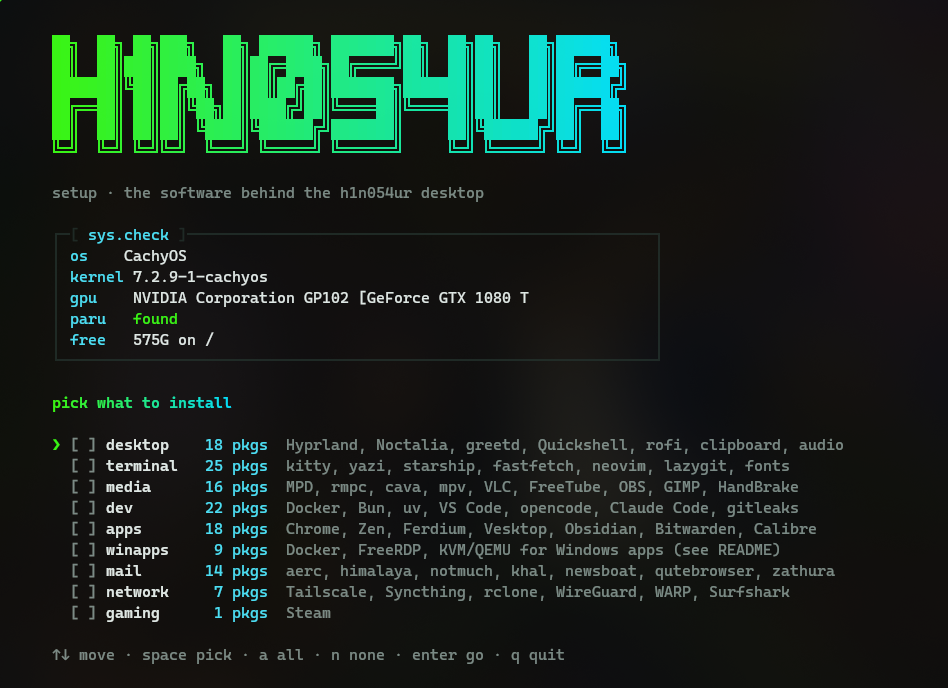
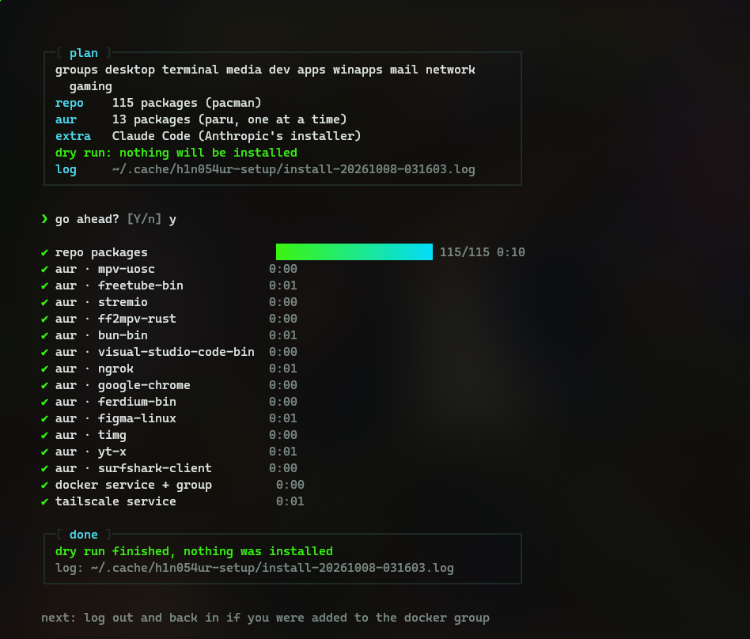
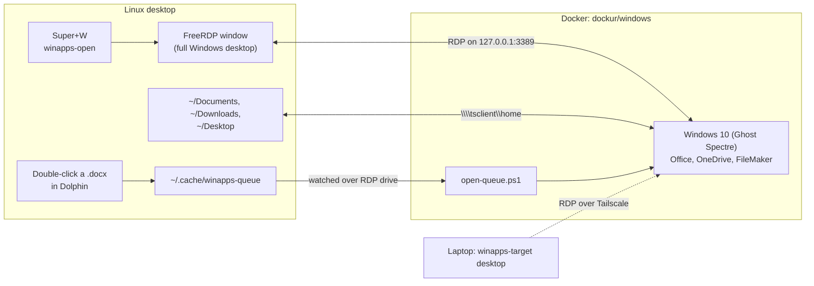

# h1n054ur setup

The software behind my desktop: CachyOS with Hyprland and the Noctalia shell, my apps by group, and Windows apps (Microsoft 365, OneDrive, FileMaker) through WinApps. The look itself lives in the other repos of [h1n054ur/desktop](https://github.com/h1n054ur/desktop).

## 1. CachyOS

Install [CachyOS](https://cachyos.org) and pick the **Hyprland** desktop in the installer (its Noctalia edition). On NVIDIA, CachyOS' hardware tool (`chwd`) picks the right driver; older Pascal cards (GTX 10xx) need the 580xx series. After the first boot:

```sh
git clone https://github.com/h1n054ur/h1n054ur-setup ~/h1n054ur-setup
cd ~/h1n054ur-setup
./install.sh                          # interactive: pick groups, see the plan, watch it install
./install.sh desktop terminal --yes   # no questions, for scripts
./install.sh --dry-run                # the whole walk-through without installing anything
```

The interactive run starts with the H1N054UR banner and a system check (OS, kernel, GPU, paru, free space), then a checklist of groups: arrow keys to move, Space to pick, `a` for all, Enter to go. A plan box shows what will happen before anything does. Sudo is asked for once. Each step gets a spinner, a progress bar fed by pacman's own `(n/m)` counter and the elapsed time; the full output goes to `~/.cache/h1n054ur-setup/`.

| Pick the groups | Watch it run |
|---|---|
|  |  |

## 2. The groups

| Group | What you get |
|---|---|
| `desktop` | Hyprland and its idle, lock, wallpaper and polkit helpers, Noctalia and its greeter, greetd, Quickshell, the fuzzel launcher, rofi, clipboard history, audio and Bluetooth controls |
| `terminal` | kitty, yazi, starship, fastfetch, zoxide, ripgrep, fd, fzf, bat, eza, btop, glances, neovim, micro, lazygit, lazydocker, the Nerd and Noto fonts |
| `media` | MPD, rmpc and cava for music; mpv with uosc, yt-dlp, VLC, FreeTube, Stremio, the Jellyfin mpv shim; HandBrake, OBS, GIMP, Avidemux |
| `dev` | git, GitHub CLI, Docker (with Compose, Buildx and the NVIDIA toolkit), Bun, uv, nvm, rbenv, VS Code, opencode, CMake, Ninja, ShellCheck, Caddy, cloudflared, ngrok, DBeaver, MySQL Workbench, Meld, gitleaks, and **Claude Code** (Anthropic's own installer, which keeps itself up to date) |
| `apps` | Chrome, Zen, Ferdium, Vesktop, Obsidian, Bitwarden with rbw and rofi-rbw, Calibre, TeamSpeak, Figma, FileZilla, Remmina, Mission Center, Dolphin, Kate, Gwenview, Thunar |
| `winapps` | Docker, FreeRDP and KVM/QEMU for the Windows container (section 3) |
| `mail` | aerc, himalaya, isync, notmuch, khal, calcurse, newsboat, qutebrowser, w3m, zathura, timg, yt-x |
| `network` | Tailscale, Syncthing with its tray, rclone, WireGuard tools, Cloudflare WARP, Surfshark |
| `gaming` | Steam |

Repo packages install in one go; AUR packages build one at a time with paru, and a failed build is listed at the end instead of stopping the run.

## 3. Windows apps with WinApps

Some things only run on Windows: Microsoft 365 desktop apps, OneDrive with Files On-Demand, FileMaker Pro. [WinApps](https://github.com/winapps-org/winapps) runs Windows in a Docker container ([dockur/windows](https://github.com/dockur/windows)) and shows it over RDP. I use the full Windows desktop in one window, on Super+W, rather than single app windows, because Office and OneDrive sign-ins only work properly there.



**Windows image.** I use a Ghost Spectre build of Windows 10 Pro (Compact 22H2): a trimmed Windows that idles at a fraction of the RAM. You supply the ISO and a Windows licence yourself; nothing here downloads Windows. Don't use dockur's evaluation images: their grace period runs out and Windows shuts down every hour.

**Set it up:**

1. `./install.sh winapps`, then follow WinApps' own setup ([docs](https://github.com/winapps-org/winapps#installation)).
2. Copy the templates and fill in every `CHANGE_ME` (a long random password, the same in both files):
   ```sh
   mkdir -p ~/.config/winapps
   cp winapps/compose.example.yaml ~/.config/winapps/compose.yaml
   cp winapps/winapps.conf.example ~/.config/winapps/winapps.conf && chmod 600 ~/.config/winapps/winapps.conf
   ```
3. Take `oem/install.bat` from the WinApps repo, append `winapps/oem/install-apps.bat` to it, and put it with `office.xml` and `openqueue/` in `~/.config/winapps/oem/`. On its first start Windows then installs Microsoft 365 (Office Deployment Tool), OneDrive for all users, FileMaker Pro if you add its installer, and the open queue.
4. On btrfs, run `chattr +C` on the container's volume folder before the first start, so the disk image isn't copy-on-write.
5. Copy `winapps/bin/winapps-open` and `winapps-target` to `~/.local/bin`, and bind Super+W to `winapps-open windows` (the [Hyprland config](https://github.com/h1n054ur/hyprland-h1n054ur) does).

**Day to day:**

- **Super+W** focuses the Windows desktop, or opens it on the next empty workspace.
- Sign in to Microsoft 365 and OneDrive **inside the full desktop**: in single-app windows the sign-in pop-ups come up blank.
- Windows only sees `~/Documents`, `~/Downloads` and `~/Desktop`. Copy `winapps/applications/windows.desktop` to `~/.local/share/applications/`, and Office files there get an **Open With → Windows** entry in Dolphin: the file is queued, and the open queue inside Windows opens it in the right app.
- The container pauses itself after 30 idle minutes (`AUTOPAUSE`). Sign out through Start, not by closing the window: Windows allows one session per user.
- **A second machine:** the laptop can use the desktop's Windows over Tailscale instead of running its own. `winapps-target desktop` switches, `winapps-target local` switches back. For that, the desktop publishes RDP on its Tailscale address (`WINAPPS_TAILNET_RDP` in the compose file).

## 4. Apps that start in the tray

Some apps open a window at login on whichever screen has focus. Two of them need a hand:

- **Bitwarden:** Settings, then turn on *Show tray icon* and *Start to tray icon*. It starts hidden; Super+P opens it.
- **Surfshark:** its *Launch minimized* setting doesn't hide the window on Hyprland. [`bin/start-to-tray`](bin/start-to-tray) starts an app, waits for its first window and closes it, and the app keeps running in the tray. Copy it to `~/.local/bin` and point Surfshark's login entry at it:

```sh
install -m 755 bin/start-to-tray ~/.local/bin/
sed -i "s#^Exec=.*#Exec=$HOME/.local/bin/start-to-tray Surfshark /opt/Surfshark/surfshark#" ~/.config/autostart/surfshark.desktop
```

The first argument is the window class (`hyprctl clients` shows it), the rest is the command. It works for any app that keeps running when its window is closed.

## Part of h1n054ur/desktop

This repo is generated from the `setup/` folder of [h1n054ur/desktop](https://github.com/h1n054ur/desktop). It is read-only: open issues and pull requests there.

## Licence

MIT, see [LICENSE](LICENSE). `install-apps.bat` is meant to be appended to WinApps' own `install.bat`, which keeps its own licence.
